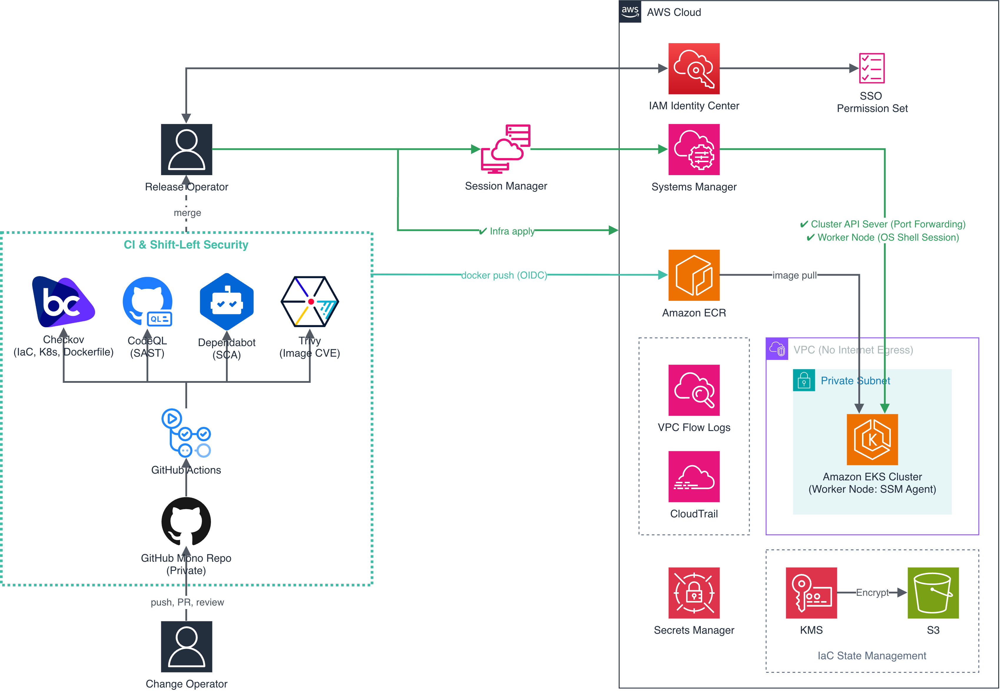

# DevSecOps EKS 파이프라인 구축

인터넷으로 나가는 경로가 없는 비공개 EKS 클러스터에 컨테이너 애플리케이션을 배포한다.
인프라 코드와 쿠버네티스 매니페스트, 애플리케이션 코드를 저장소 하나에서 관리하고,
검사는 GitHub Actions가 실행하며 상태를 변경하는 작업은 사람이 실행한다.

다이어그램은 저장소를 비공개로 두고 GitHub Code Security 라이선스를 사용하는 구성을
전제한다. 이 저장소는 코드와 검사 결과를 열람할 수 있게 공개로 전환했고, 그 대신
Free 요금제에서 code scanning을 사용할 수 있다.

## 네트워크와 클러스터

VPC에 인터넷 게이트웨이와 NAT 게이트웨이를 생성하지 않는다. 워커 노드가 AWS API를
호출하는 경로는 VPC 엔드포인트뿐이고, S3 게이트웨이 엔드포인트에는 ECR 이미지 레이어
버킷과 세션 로그 버킷만 허용하는 정책을 적용했다. 관리자 자격 증명을 보유해도 이 VPC
안에서는 다른 버킷에 접근할 수 없다.

EKS 클러스터의 API 서버 엔드포인트는 비공개다. kubectl은 Session Manager 포트 포워딩으로
워커 노드를 경유해 접속한다. 워커 노드 보안 그룹의 인바운드 규칙은 컨트롤
플레인에서 kubelet 포트로 들어오는 것과 노드 사이 파드 통신 둘이다.

인스턴스 메타데이터 서비스는 IMDSv2를 강제하고 홉 제한을 1로 설정했다. 파드에서 노드
역할의 자격 증명을 조회하는 요청은 홉 제한에 막혀 응답을 받지 못한다.

파드는 Pod Security Admission의 restricted 프로파일을 강제하는 네임스페이스에서 실행된다.
루트 파일시스템을 읽기 전용으로 설정하고, 애플리케이션이 쓰기를 요구하는 자리는 `/tmp`에
연결한 emptyDir 하나로 제한했다.

## 검사와 머지 판정

pull request마다 검사 아홉 개가 실행되고, 하나라도 실패하면 머지 버튼이 비활성화된다.

Checkov(Terraform과 쿠버네티스 매니페스트, Dockerfile 정적 분석)가 프레임워크별로 다섯 개,
CodeQL(소스 코드 정적 분석)이 언어별로 두 개, Trivy(컨테이너 이미지 CVE 검사)를 포함한
이미지 잡이 하나, Terraform plan이 하나다. Dependabot(의존성 갱신)은 GitHub Actions와 pip,
Docker 세 생태계를 대상으로 갱신 pull request를 생성한다.

검사 결과는 SARIF로 업로드되어 Security 탭에 누적된다. required status check만으로는
CodeQL이 보고한 결함이 머지를 차단하지 못하므로, code scanning 머지 보호를 함께 활성화하고
임계값을 전체 등급으로 설정했다.

도구가 지적한 항목 중 이 구성에서 적용하지 않기로 판단한 것은 `.checkov.yml`에 기록되어
있다. 각 항목에는 그 판단의 근거가 주석으로 함께 적혀 있다.

## 접근 경로

사람은 IAM Identity Center로 로그인하고 SSO 권한 세트가 각 계정에 생성한 역할을 수임한다.
운영 반영용 권한 세트와 읽기 전용 권한 세트를 나누어 두었고, 액세스 키를 생성하지 않는다.
클러스터 접근은 EKS Access Entry가 그 SSO 역할을 대상으로 부여한다.

워커 노드에는 SSH 인바운드 규칙과 키 페어가 없다. 셸 접속은 Systems Manager의 Session
Manager로만 가능하고, 세션 기록은 S3 버킷에 저장된다. 그 버킷에는 노드 역할을 지목해
삭제를 거부하는 정책을 적용했다. 세션 셸에 접속한 운영자가 노드 역할의 자격 증명으로 자기
명령 기록을 삭제할 수 있으면 그 기록은 증거로 사용할 수 없다.

CI는 OIDC로 역할을 수임한다. plan 역할은 읽기 권한만, 이미지 업로드 역할은 지정한 ECR
리포지터리에 대한 쓰기만 보유한다.

## 배포

배포할 이미지 참조를 매니페스트에 커밋하지 않는다. 이미지 태그가 커밋 SHA이고 그 태그를
매니페스트에 기록하는 것도 커밋이므로, 자기가 생성한 이미지를 참조하는 커밋은 존재할 수
없다. `k8s/deployment.yaml`은 참조의 형태만 보유하고, `scripts/deploy.sh`가 배포 시점에
계정 ID와 커밋 SHA, 다이제스트를 계산해 채운다.

`scripts/deploy.sh`는 실행 전에 두 가지를 확인한다. `k8s/`와 `app/`에 커밋되지 않은 변경이
없는지, `HEAD`가 `origin/main`과 같은지다. 저장소에 없는 내용이 클러스터에 적용되는
경로를 차단하고, 지난 커밋에서 실행했을 때 그 커밋의 이미지가 ECR에 남아 있는 한
실패하지 않고 지난 이미지가 적용되는 것을 차단한다.

## 시크릿

Secrets Manager 시크릿의 값을 write-only 인자로 전달해 Terraform state에 기록되지 않게
했다. `sensitive = true`는 CLI 출력만 가리고 state 파일과 plan 파일에는 평문을 남긴다.
plan을 실행하는 CI가 state를 복호화할 수 있으므로, 표시를 가리는 것으로는 부족하고 값
자체가 state에 존재하지 않아야 한다.

값은 apply 시점에 환경변수로만 주입한다. AWS provider 6.26.0부터 write-only 모드에서는
`GetSecretValue` 대신 `ListSecretVersionIds`를 호출하므로, plan 역할에 시크릿 읽기 권한을
부여하지 않아도 refresh가 통과한다.

## 감사

CloudTrail이 API 호출을 S3에 기록하고, VPC Flow Logs가 패킷 헤더를 CloudWatch Logs에
기록하며, EKS audit 로그가 클러스터 API 요청을 CloudWatch Logs에 기록한다. Terraform
state는 KMS 고객 관리형 키로 암호화한 S3 버킷에 저장하고, 그 키에 대한 복호화 호출이
CloudTrail에 남는다.

## 저장소 구조

    app/         애플리케이션 코드와 Dockerfile
    bootstrap/   Terraform state를 저장할 S3 버킷과 KMS 키
    docs/        저장소에 남지 않는 설정의 기록
    infra/       VPC, EKS, IAM, ECR, 로깅, 시크릿
    k8s/         네임스페이스와 Deployment 매니페스트
    scripts/     터널, kubeconfig, 배포 스크립트

`.github/workflows/`에 워크플로 다섯 개가 있다. Terraform plan, 이미지 빌드와 검사와 업로드,
Checkov, CodeQL, 주 1회 이미지 재검사다.

## 실행 전제

Terraform 1.14.3과 AWS provider 6.60.0을 사용한다. write-only 인자는 Terraform 1.11과 AWS
provider 5.83 미만에서 동작하지 않는다.

`bootstrap/`을 로컬에서 먼저 적용해 state 저장소를 생성한 뒤 `infra/`를 초기화한다.
`infra/backend.tf`는 버킷 이름과 KMS 키 ARN을 보유하지 않으므로
`terraform init -backend-config=backend.hcl`로 전달한다. `backend.hcl`은 저장소에 포함되지
않는다.

## 현재 상태

이 저장소가 생성한 AWS 리소스는 전부 제거되어 있다. 각 구현 단계는 만든 것을 제거하는
것으로 종료했고, 재현 검증에서 전체 제거 후 `terraform apply` 한 번으로 다시 생성해 파드가
실행되는 것까지 확인했다. 그 기록은 [docs/reproduction.md](docs/reproduction.md)에 있다.

구현 과정은 블로그 시리즈로 기록했다. 각 단계의 판단과 그 근거, 실패한 시도 등을 남긴다.

<https://itcase.tistory.com/entry/devsecops-00>