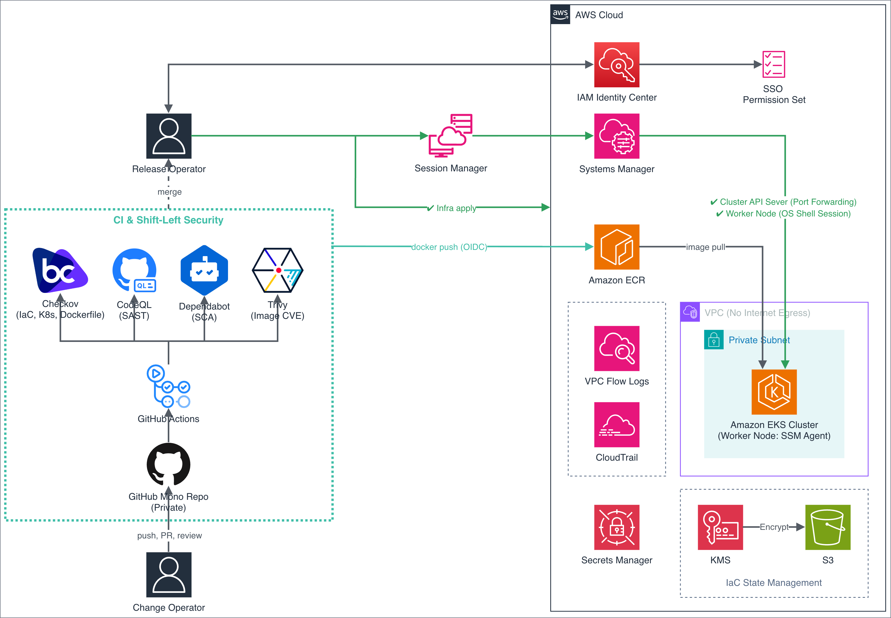
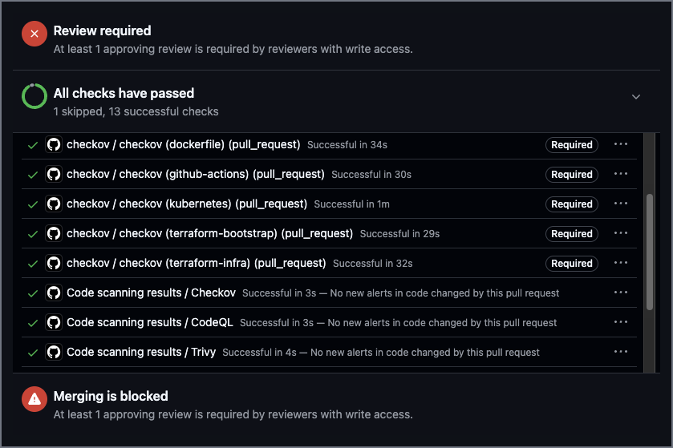

# devsecops-eks-pipeline

인터넷 송신 경로 없는 비공개 EKS 클러스터. 검사 아홉 개가 막는 머지. 사람이 실행하는 배포.
인프라 코드와 쿠버네티스 매니페스트, 애플리케이션 코드를 저장소 하나에서 관리한다.

다이어그램은 저장소를 비공개로 두고 GitHub Code Security 라이선스를 사용하는 구성을
전제한다. 이 저장소는 코드와 검사 결과를 열람할 수 있게 공개로 전환하며, code scanning을 사용한다.

## 네트워크와 클러스터

**인터넷 방향의 경로를 제한한다.** VPC에 인터넷 게이트웨이와 NAT 게이트웨이를 생성하지 않는다.
워커 노드가 AWS API를 호출하는 경로는 VPC 엔드포인트 한정, S3 게이트웨이 엔드포인트에는
ECR 이미지 레이어 버킷과 세션 로그 버킷만 허용하는 정책을 적용한다. 관리자 자격 증명을
보유해도 이 VPC 안에서는 다른 버킷에 접근할 수 없다.

**클러스터 엔드포인트는 비공개한다.** kubectl은 Session Manager 포트 포워딩으로 워커 노드를
경유해 접속한다. 워커 노드 보안 그룹의 인바운드 규칙은 컨트롤 플레인에서 kubelet 포트로
들어오는 것과 노드 사이 파드 통신 둘이다.

**파드의 노드 역할 자격 증명 조회를 금지한다.** 인스턴스 메타데이터 서비스가 IMDSv2를
강제하고 홉 제한은 1, 파드에서 나간 요청은 응답을 받지 못한다.

**파를는 restricted 프로파일 아래에서 실행한다.** Pod Security Admission을 강제하는
네임스페이스이며, 루트 파일시스템은 읽기 전용이다. 애플리케이션이 쓰기를 요구하는 자리는
`/tmp`에 연결한 emptyDir 하나로 제한한다.

## 검사와 머지 판정

pull request마다 검사 9개가 실행되고, 하나라도 실패하면 머지 버튼이 비활성화된다.

| 검사 | 역할 | 개수 |
| --- | --- | --- |
| Checkov | Terraform과 쿠버네티스 매니페스트, Dockerfile 정적 분석 | 프레임워크별 5 |
| CodeQL | 소스 코드 정적 분석 | 언어별 2 |
| Trivy | 컨테이너 이미지 CVE 검사 | 이미지 잡 1에 포함 |
| Terraform plan | 변경 대상 확인 | 1 |

Dependabot(의존성 갱신)은 GitHub Actions와 pip, Docker 세 생태계를 대상으로 갱신
pull request를 생성한다.

**required status check만으로 판정하지 않는다.** 검사 결과는 SARIF로 업로드되어 Security 탭에
누적되는데, 잡이 통과해도 CodeQL이 보고한 결함은 그대로 남는다. code scanning 머지 보호를
함께 활성화하고 임계값을 전체 등급으로 설정한다.

## 접근 경로

**액세스 키를 생성하지 않는다.** 사람은 IAM Identity Center로 로그인하고 SSO 권한 세트가
각 계정에 생성한 역할을 수임한다. 운영 반영용과 읽기 전용 둘로 나눈다. 클러스터
접근은 EKS Access Entry가 해당 SSO 역할을 대상으로 부여한다.

**노드에 SSH 인바운드 규칙과 키 페어를 두지 않는다.** 셸 접속은 Systems Manager의 Session
Manager로 한정하고, 세션 기록은 S3 버킷에 저장한다. 해당 버킷에는 노드 역할을 지목해
삭제를 거부하는 정책을 적용한다. 세션 셸에 접속한 운영자가 노드 역할의 자격 증명으로 자기
명령 기록을 삭제할 수 있으면 해당 기록은 증거로 사용할 수 없기 때문이다.

**CI는 OIDC로 역할을 수임한다.** plan 역할은 읽기 권한만, 이미지 업로드 역할은 지정한 ECR
리포지터리에 대한 쓰기만 보유한다.

## 배포

**배포할 이미지 참조를 매니페스트에 커밋하지 않는다.** 이미지 태그가 커밋 SHA이고 그 태그를
매니페스트에 기록하는 것도 커밋이므로, 자기가 생성한 이미지를 참조하는 커밋은 존재할 수
없다. `k8s/deployment.yaml`은 참조의 형태만 보유하고, `scripts/deploy.sh`가 배포 시점에
계정 ID와 커밋 SHA, 다이제스트를 계산해 채운다.

`scripts/deploy.sh`는 실행 전에 두 가지를 확인한다.

- `k8s/`와 `app/`에 커밋되지 않은 변경이 없는지. 저장소에 없는 내용이 클러스터에 적용되는
  경로를 차단한다.
- `HEAD`가 `origin/main`과 같은지. 기본 브랜치가 아닌 지난 커밋의 이미지가 배포되는 경로를
  차단한다. 

## 시크릿

**`sensitive = true`로는 부족하다.** 해당 인자는 CLI 출력만 가리고 state 파일과 plan 파일에는
평문을 남긴다. plan을 실행하는 CI가 state를 복호화할 수 있으므로, 표시를 가리는 것이 아니라
값 자체가 state에 존재하지 않아야 한다.

**write-only 인자로 전달한다.** 값은 apply 시점에 환경변수로만 주입한다. AWS provider
6.26.0부터 write-only 모드에서는 `GetSecretValue` 대신 `ListSecretVersionIds`를 호출하므로,
plan 역할에 시크릿 읽기 권한을 부여하지 않아도 refresh가 통과한다.

## 감사

| 기록 | 대상 | 저장 위치 |
| --- | --- | --- |
| CloudTrail | AWS API 호출 | S3 |
| VPC Flow Logs | 패킷 헤더 | CloudWatch Logs |
| EKS audit | 클러스터 API 요청 | CloudWatch Logs |
| Session Manager | 셸 세션 기록 | S3 |

Terraform state는 KMS 고객 관리형 키로 암호화한 S3 버킷에 저장하고, 그 키에 대한 복호화
호출이 CloudTrail에 남는다.

## 저장소 구조

| 경로 | 내용 |
| --- | --- |
| `app/` | 애플리케이션 코드와 Dockerfile |
| `bootstrap/` | Terraform state를 저장할 S3 버킷과 KMS 키 |
| `docs/` | 저장소에 남지 않는 설정의 기록 |
| `infra/` | VPC, EKS, IAM, ECR, 로깅, 시크릿 |
| `k8s/` | 네임스페이스와 Deployment 매니페스트 |
| `scripts/` | 터널, kubeconfig, 배포 스크립트 |

| 워크플로 | 하는 일 |
| --- | --- |
| `plan.yml` | Terraform plan |
| `image.yml` | 이미지 빌드, 스모크 테스트, Trivy 검사, ECR 업로드 |
| `checkov.yml` | 프레임워크 다섯 개 정적 분석 |
| `codeql.yml` | 언어 두 개 정적 분석 |
| `rescan.yml` | 주 1회 기본 브랜치 이미지 재검사 |

## 실행 전제

- Terraform 1.14.3, AWS provider 6.60.0. write-only 인자는 Terraform 1.11과 AWS provider
  5.83 미만에서 동작하지 않는다.
- `bootstrap/`을 로컬에서 먼저 적용해 state 저장소를 생성한 뒤 `infra/`를 초기화한다.
- `infra/backend.tf`는 버킷 이름과 KMS 키 ARN을 보유하지 않는다.
  `terraform init -backend-config=backend.hcl`로 전달하고, `backend.hcl`은 저장소에
  포함되지 않는다.

## 현재 상태

해당 저장소가 생성한 AWS 리소스는 전부 제거된 상태다. 각 구현 단계는 만든 것을 제거하는
것으로 종료했고, 재현 검증에서 전체 제거 후 `terraform apply` 한 번으로 다시 생성해 파드가
실행되는 것까지 확인했다. [docs/reproduction.md](docs/reproduction.md)에 기록한다.

구현 과정은 블로그 시리즈를 작성한다. 각 단계의 판단과 그 근거, 실패한 시도 등을 남긴다.

<https://itcase.tistory.com/entry/devsecops-00>